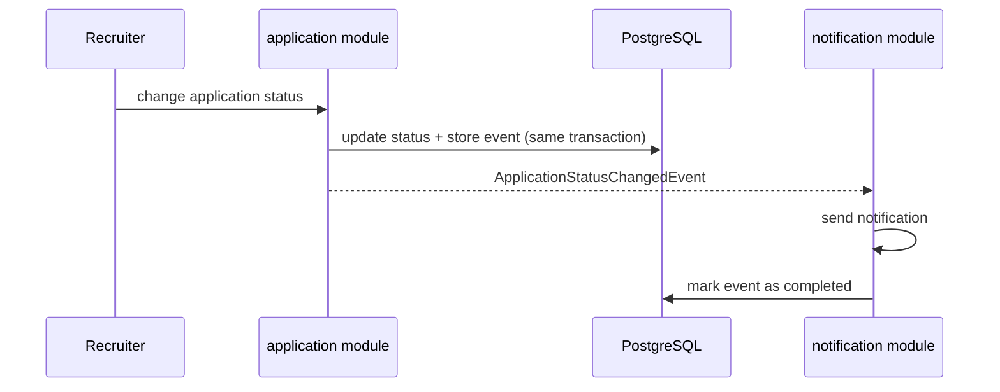
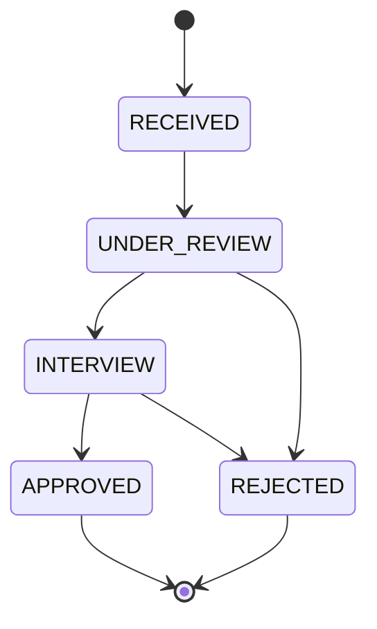

# HireTrack

HireTrack is a job posting and application tracking system built with **Java 21** and **Spring Boot**.
The project is designed as a **modular monolith** using **Spring Modulith**, with clear module boundaries and
event-driven communication, prepared to evolve into microservices when it makes sense.

## Goals

- Model a real hiring flow with a well-defined **state machine** for job applications
- Keep modules decoupled through **domain events**
- Guarantee reliable event delivery using an **outbox-style** event publication registry
- Start simple (modular monolith) and **extract services** later, only where there is a clear benefit

## Tech Stack

| Concern              | Technology                          |
|----------------------|-------------------------------------|
| Language             | Java 21                             |
| Framework            | Spring Boot 3                       |
| Modularity           | Spring Modulith                     |
| Persistence          | Spring Data JPA + PostgreSQL        |
| Database migrations  | Flyway                              |
| Validation           | Bean Validation                     |
| Local infrastructure | Docker Compose                      |
| Tests                | JUnit 5 + Testcontainers            |
| Build                | Maven                               |

## Architecture

HireTrack is a **modular monolith**. Each top-level package under `br.com.hiretrack` is an application module.
Modules can only access each other's public API; internal classes stay hidden in sub-packages.
Spring Modulith verifies these boundaries in the test suite.

```
br.com.hiretrack
├── job/            → job postings (create, list, close)
├── application/    → candidates, job applications and the status state machine
└── notification/   → listens to domain events and notifies candidates
```

### Module communication

Modules do **not** call each other directly for side effects. Instead, they publish and listen to **domain events**.



Events are persisted in the `event_publication` table within the same transaction as the business change.
If a listener fails, the event remains incomplete and can be republished, similar to the **Outbox Pattern**.

## Application Status State Machine

A job application can only be in **one status at a time** and can only move through **allowed transitions**.



Rules are enforced inside the domain:

- The `status` field is private and has **no setter**
- Status changes only happen through `JobApplication.changeStatus(newStatus)`
- `ApplicationStatus.canTransitionTo(target)` defines which transitions are valid
- Invalid transitions throw a domain exception

## Domain Model

| Entity           | Description                                         |
|------------------|-----------------------------------------------------|
| `Job`            | A job posting published by a company                |
| `Candidate`      | A person applying for jobs                          |
| `JobApplication` | Links a candidate to a job and tracks its status    |

## Getting Started

### Prerequisites

- Java 21
- Docker (for PostgreSQL via Docker Compose and Testcontainers)

### Running locally

```bash
./mvnw spring-boot:run
```

Spring Boot Docker Compose support starts PostgreSQL automatically using `compose.yaml`.

### Running tests

```bash
./mvnw test
```

Integration tests use Testcontainers with a real PostgreSQL instance.
The module structure is verified with Spring Modulith's `ApplicationModules.verify()`.

## Roadmap

- [x] Project setup (Spring Boot, Modulith, PostgreSQL, Flyway)
- [x] `job` module: create and list job postings
- [x] `application` module: apply to a job, status state machine
- [x] `ApplicationStatusChangedEvent` + `notification` module listener
- [ ] Resume upload (PDF)
- [x] Standardized error handling (`lib-exception`)
- [ ] Module documentation generated by Spring Modulith
- [ ] **Extract `notification` into a standalone microservice**
  - Externalize events to RabbitMQ with `@Externalized`
  - Retry and dead-letter queue handling
  - Optional: store notification history in MongoDB
